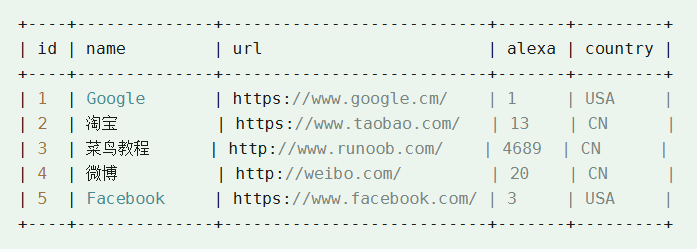
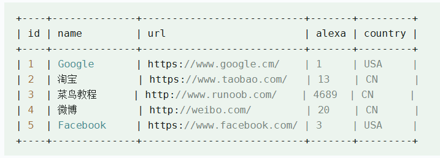
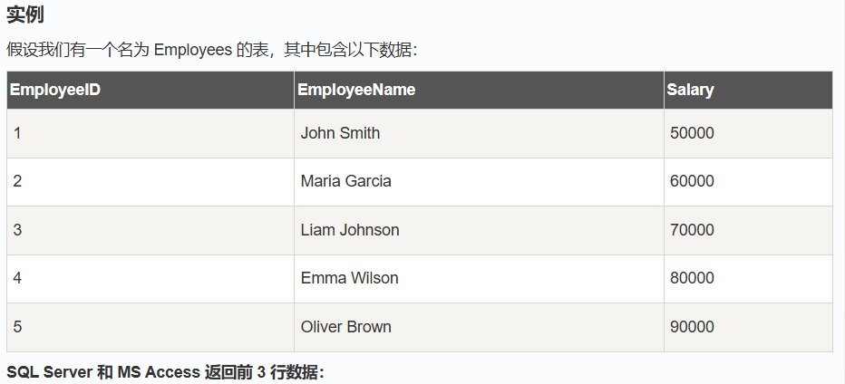
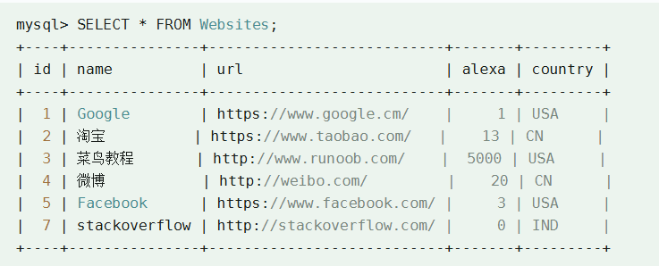
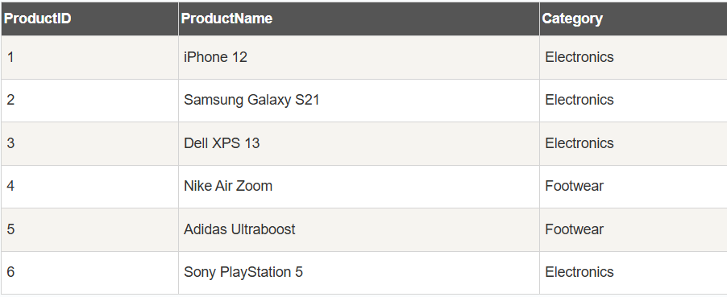

`ASC` 表示升序，`DESC` 表示降序

**GROUP BY**：用于将结果集按一列或多列进行分组。

**HAVING**：用于对分组后的结果集进行筛选。

**DISTINCT**：用于返回唯一不同的值。

## select 字段1,字段2，...... from table

## select distinct 字段 from 表

##  where：运算符

下面的运算符可以在 WHERE 子句中使用：

| 运算符  | 描述                                                       |
| :------ | :--------------------------------------------------------- |
| =       | 等于                                                       |
| <>      | 不等于。**注释：**在 SQL 的一些版本中，该操作符可被写成 != |
| >       | 大于                                                       |
| <       | 小于                                                       |
| >=      | 大于等于                                                   |
| <=      | 小于等于                                                   |
| BETWEEN | 在某个范围内                                               |
| LIKE    | 搜索某种模式                                               |
| IN      | 指定针对某个列的多个可能值                                 |

## order by :

关键字用于对结果集按照一个列或者多个列进行排序;

关键字默认按照升序对记录进行排序.

asc:升序

desc:降序



SQL 语句从 "Websites" 表中选取所有网站，并按照 "alexa" 列排序：

升序：

SELECT URL FROM Websites  

ORDER  BY alexa;

降序：

SELECT URL FROM Websites

ODER BY alexa DESC;

下面的 SQL 语句从 "Websites" 表中选取所有网站，并按照 "country" 和 "alexa" 列排序

SELECT * FROM Websites ORDER BY country,alexa;

## INSERT INTO

INSERT INTO TABLE_NAME

VALUES(values1,values2,values3);

INSERT INTO TABLE NAME(column1,column2,.....)

VALUES(values1,values2,....)

## UPDATE 

UPDATE TABLE_NAME

SET COLUMN1=VALUES1,COLUMN1=VALUES2,...

WHERE CONDITION;



假设我们要把 "菜鸟教程" 的 alexa 排名更新为 5000，country 改为 USA。

我们使用下面的 SQL 语句：

UPDATE Websites  SET alexa='5000', country='USA'  WHERE name='菜鸟教程';

## DELETE 

DELETE FROM TABLE_NAME

WHERE CONDITION;

## SELECT TOP, LIMIT, ROWNUM

SELECT TOP 语句用于在 SQL 中限制返回的结果集中的行数， 它通常用于只需要查询前几行数据的情况，尤其在数据集非常大时，可以显著提高查询性能。

SELECT TOP number/percent COLUMN1,COLUMN2,...

FROM TABLE_NAME;



SELECT TOP 3 *

FROM Employes;

返回前 10% 的数据：

SELECT TOP 10 PERCENT *

FROM  Employes;



下面的 SQL 语句从 "Websites" 表中选取头两条记录：

SELECT * FROM Websites LIMIT 2;

(SELECT TOP 2 * FROM Websites;)

## LIKE

LIKE 操作符用于在 WHERE 子句中搜索列中的指定模式。

`LIKE` 操作符是 SQL 中用于在 `WHERE` 子句中进行模糊查询的关键字，它允许我们根据模式匹配来选择数据，通常与 `%` 和 `_` 通配符一起使用。

SELECT COLUMN1,COLUMN2...

FROM TABLE_NAME

WHERE COLUMN_NAME LIKE pattern;

**通配符**

- **`%`：匹配任意字符（包括零个字符）。**
- **`_`：匹配单个字符。**



使用 **%** 通配符找出所有以 "iPhone" 开头的产品：

SELECT  ProductName, Category

FROM Products

WHERE RroductName LIKE 'IPhone%';

使用 **_** 通配符找出所有产品名称第二个字符为 "e" 的产品：

```
SELECT ProductName, Category
FROM Products
WHERE ProductName LIKE '_e%';
```

结合 **%** 和 **_** 通配符找出所有产品名称包含 "Zoom" 的产品：

```
SELECT ProductName, Category
FROM Products
WHERE ProductName LIKE '%Zoom%';
```